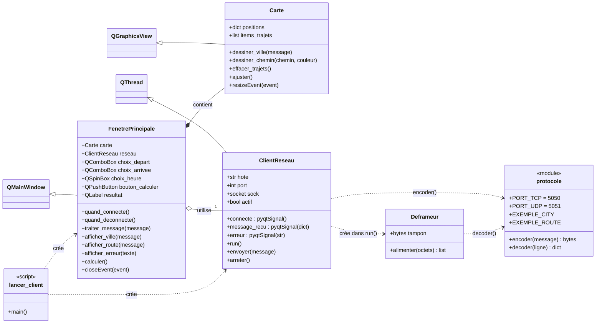
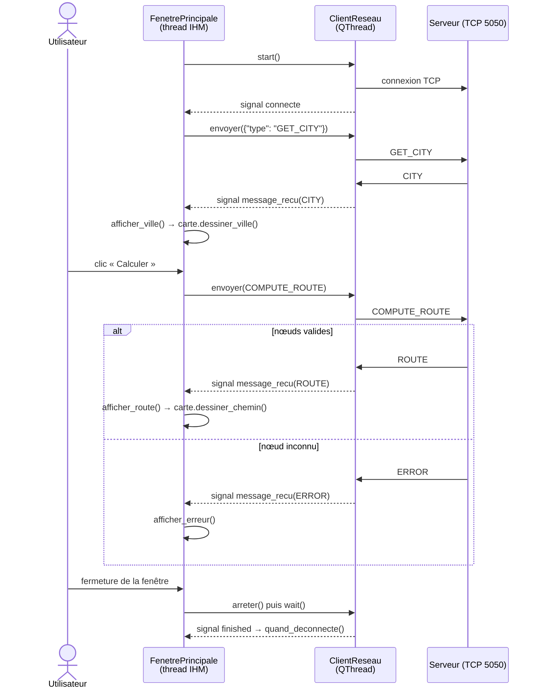

# UML — partie client (étapes 4 et 5)

## Diagramme de classes

```mermaid
classDiagram
    direction LR

    class QMainWindow
    class QGraphicsView
    class QThread

    class FenetrePrincipale {
        +Carte carte
        +ClientReseau reseau
        +QComboBox choix_depart
        +QComboBox choix_arrivee
        +QSpinBox choix_heure
        +QPushButton bouton_calculer
        +QLabel resultat
        +quand_connecte()
        +quand_deconnecte()
        +traiter_message(message)
        +afficher_ville(message)
        +afficher_route(message)
        +afficher_erreur(texte)
        +calculer()
        +closeEvent(event)
    }

    class Carte {
        +dict positions
        +list items_trajets
        +dessiner_ville(message)
        +dessiner_chemin(chemin, couleur)
        +effacer_trajets()
        +ajuster()
        +resizeEvent(event)
    }

    class ClientReseau {
        +str hote
        +int port
        +socket sock
        +bool actif
        +connecte : pyqtSignal()
        +message_recu : pyqtSignal(dict)
        +erreur : pyqtSignal(str)
        +run()
        +envoyer(message)
        +arreter()
    }

    class Deframeur {
        +bytes tampon
        +alimenter(octets) list
    }

    class protocole {
        <<module>>
        +PORT_TCP = 5050
        +PORT_UDP = 5051
        +EXEMPLE_CITY
        +EXEMPLE_ROUTE
        +encoder(message) bytes
        +decoder(ligne) dict
    }

    class lancer_client {
        <<script>>
        +main()
    }

    QMainWindow <|-- FenetrePrincipale
    QGraphicsView <|-- Carte
    QThread <|-- ClientReseau

    FenetrePrincipale *-- Carte : contient
    FenetrePrincipale o-- "1" ClientReseau : utilise
    ClientReseau ..> Deframeur : crée dans run()
    ClientReseau ..> protocole : encoder()
    Deframeur ..> protocole : decoder()
    lancer_client ..> FenetrePrincipale : crée
    lancer_client ..> ClientReseau : crée
```

## Diagramme de séquence — connexion puis calcul d'un trajet

```mermaid
sequenceDiagram
    actor U as Utilisateur
    participant F as FenetrePrincipale<br/>(thread IHM)
    participant R as ClientReseau<br/>(QThread)
    participant S as Serveur (TCP 5050)

    F->>R: start()
    R->>S: connexion TCP
    R-->>F: signal connecte
    F->>R: envoyer({"type": "GET_CITY"})
    R->>S: GET_CITY
    S->>R: CITY
    R-->>F: signal message_recu(CITY)
    F->>F: afficher_ville() → carte.dessiner_ville()

    U->>F: clic « Calculer »
    F->>R: envoyer(COMPUTE_ROUTE)
    R->>S: COMPUTE_ROUTE
    alt nœuds valides
        S->>R: ROUTE
        R-->>F: signal message_recu(ROUTE)
        F->>F: afficher_route() → carte.dessiner_chemin()
    else nœud inconnu
        S->>R: ERROR
        R-->>F: signal message_recu(ERROR)
        F->>F: afficher_erreur()
    end

    U->>F: fermeture de la fenêtre
    F->>R: arreter() puis wait()
    R-->>F: signal finished → quand_deconnecte()
```
